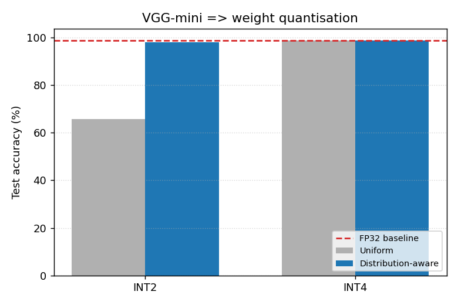
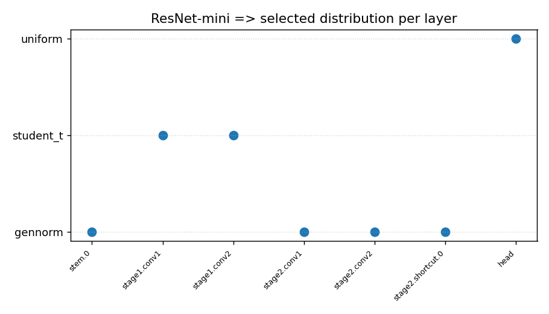

# CoStat - Distribution-aware quantisation of weights and activations.


Standard low-bit quantisation treats every weight the same: it slices the value
range into evenly spaced levels. The trouble is that real weight tensors are not
spread evenly - they pile up near zero with thin tails. Even spacing therefore
spends most of its precious 2- or 4-bit levels on regions that are almost empty
and starves the dense middle where it matters. The same waste shows up when a
tanh is approximated by line segments: uniform breakpoints squander resolution
on the flat saturation tails.

CoStat fixes both by looking at the data first. It profiles a trained network,
fits a probability distribution to each layer, and then places quantisation
levels (and activation breakpoints) at *equal-probability* points of that fitted
distribution - so resolution follows the data instead of the number line.

This repository implements the **software side** of that idea, with an enhanced
controller for the "fit and choose a distribution" step.

---

## What the controller does

The original method fitted three families - Gaussian, Laplacian, Uniform - and
picked the winner by KL divergence alone. That has two weak spots: KL is
sensitive to how you bin the histogram, and it happily rewards a more flexible
family even when the extra flexibility is not earned.

The controller here is more careful on both fronts:

- **A wider candidate family.** Gaussian, Laplacian, Uniform, Logistic,
  Student-t, generalised Normal, and skew-Normal. Regularised weights are often
  heavier-tailed than a Gaussian and more skewed than a Laplacian, and these
  extra families capture that.
- **A panel of judges instead of one.** Each fit is scored by KL divergence,
  BIC, the Kolmogorov-Smirnov statistic, and the Wasserstein distance. The BIC
  term explicitly charges a family for every extra parameter it uses, so a
  three-parameter family only wins when it genuinely fits better.
- **Selection by rank, not raw score.** The metrics disagree on scale, so each
  one *ranks* the candidates and the controller adds the ranks. A family has to
  do well across several independent criteria to be chosen, which makes the pick
  stable rather than a coin toss between two close fits.

Because every candidate is exposed through the same `pdf` / `cdf` / `ppf`
interface, the quantiser never needs a special case per family. Whatever the
controller selects, the quantiser reads its quantile function to place levels and
integrates its density to find the optimal (Lloyd-Max) reconstruction value for
each bin. Add a new distribution to `config/distributions.json` and the whole
pipeline picks it up.

---

## The flow

1. **Train** an FP32 baseline (Stage 1).
2. **Profile** every weight tensor and the pre-activation values feeding each
   tanh (Stage 2).
3. **Fit and select** a distribution per layer with the controller above
   (Stage 3).
4. **Quantise weights** - uniform baseline vs. distribution-aware - at INT2 and
   INT4, and **approximate tanh** with uniform vs. distribution-aware
   piecewise-linear breakpoints (Stage 4).
5. **Report** accuracy, approximation error, and the selected family per layer.

The hardware export and FPGA synthesis stages from the paper are intentionally
out of scope here - this is the software half.

---

## Models and data

Benchmarked on **MNIST** (padded to 32x32) with three standard architectures,
all using tanh activations so the piecewise-linear step is meaningful:

- **LeNet-5** - the classic reference.
- **VGG-mini** - stacked 3x3 convolutions.
- **ResNet-mini** - residual blocks with batch norm.

---

## Results

### Weight quantisation - test accuracy (%)

| Model | FP32 | INT2 uniform | INT2 dist-aware | INT4 uniform | INT4 dist-aware |
|-------|-----:|-------------:|----------------:|-------------:|----------------:|
| LeNet-5     | 98.52 | 95.40 | **96.62** | 98.40 | 98.33 |
| VGG-mini    | 98.87 | 65.69 | **98.10** | 98.83 | 98.86 |
| ResNet-mini | 85.71 |  9.58 | **10.80** | 38.59 | **40.87** |

The story tracks depth. At INT4 the two methods are a wash - four bits is enough
either way. At INT2 the picture splits. LeNet-5 is shallow, so even uniform holds
up and distribution-aware adds a point. VGG-mini is the headline: uniform INT2
collapses to **65.7%** while distribution-aware recovers to **98.1%**, a
**+32.4** point swing that comes purely from where the levels are placed.
ResNet-mini is the hard case - a deep, batch-normalised net pushed to 2 bits with
no fine-tuning - where neither method fully recovers, but distribution-aware is
ahead at every bit-width. The takeaway is consistent: distribution-aware never
loses, and the harder the setting, the more it helps.

### PWL tanh approximation

Placing breakpoints at equal-probability quantiles of the pre-activations cuts
the density-weighted approximation error by **38-58%** on most tanh layers (per
`results/pwl_activation.csv`). On ResNet-mini that sharper activation shape lifts
end-to-end accuracy from **47.7%** (uniform breakpoints) to **76.5%**.

### Which family gets picked

Across all three models the controller almost never lands on plain Gaussian or
Laplacian - it overwhelmingly selects **generalised Normal** and **Student-t**.
That is the enhanced controller earning its keep: the real weight tails are
heavier than the original three-family set could describe, and the wider
candidate pool plus the BIC-guarded ranking pick that up instead of settling for
a mediocre Gaussian.




Figures for every model land in `plots/` and the raw numbers in `results/`:

- `accuracy_vs_bitwidth_<model>.png` - uniform vs. distribution-aware accuracy.
- `selected_distributions_<model>.png` - which family won, per layer.
- `pwl_error_<model>.png` - tanh approximation error, per tanh.
- `weight_fit_<model>_<layer>.png` - a fitted density over the real histogram.

---

## Running it

```bash
python -m venv venv
source venv/bin/activate
pip install -r requirements.txt

python run.py          # run the full benchmark
python run.py -v       # same, with debug logging
```

MNIST downloads automatically on the first run. Everything tunable - epochs,
bit-widths, the candidate families, the scoring metrics - lives in `config/`,
so the sources stay free of magic numbers and hardcoded paths.

---

## Layout

```
config/        config.ini plus the distribution / scoring / model registries
costat/
  controller/  candidate fitting, scoring metrics, rank-based selection
  quantization/ weight quantisers and the PWL tanh approximation
  models/      LeNet-5, VGG-mini, ResNet-mini and a name-driven factory
  profiling/   weight and pre-activation collection
  pipeline/    training, evaluation, plotting, and the benchmark orchestrator
results/       CSV reports
plots/         generated figures
```
